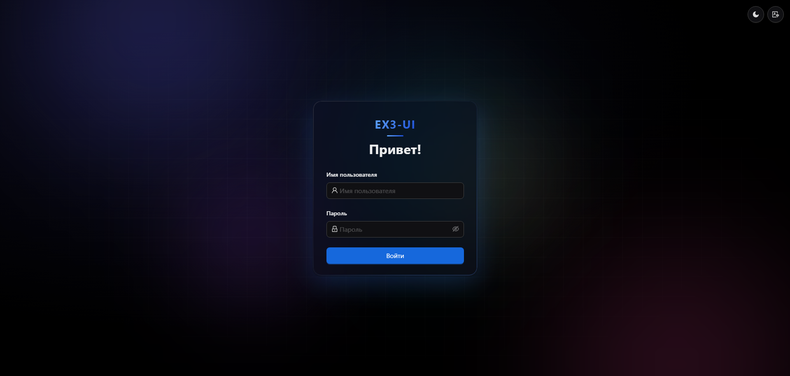
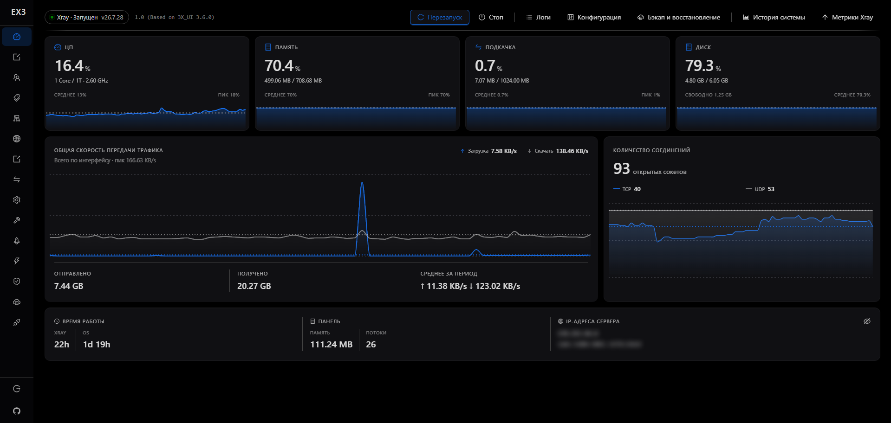
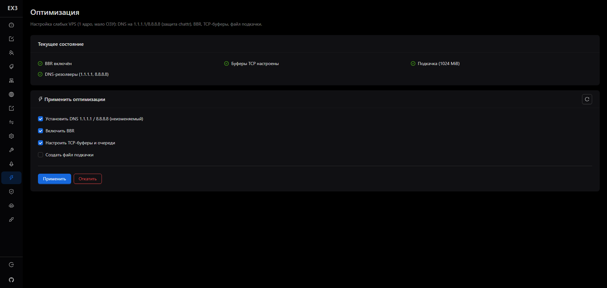
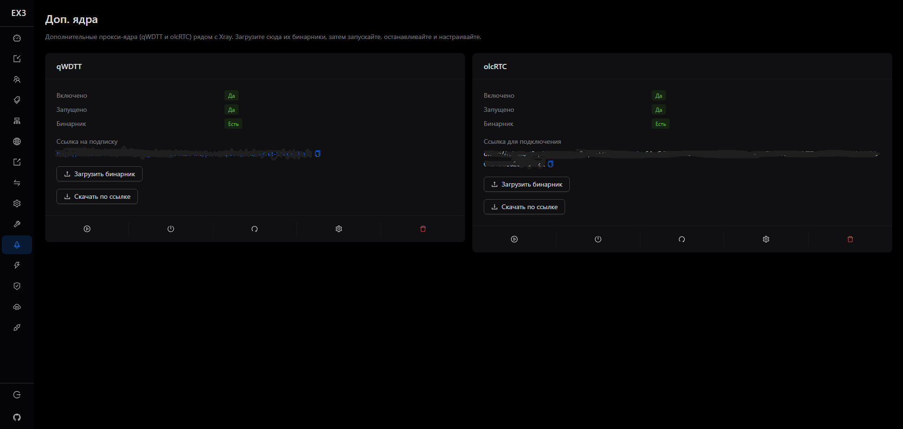
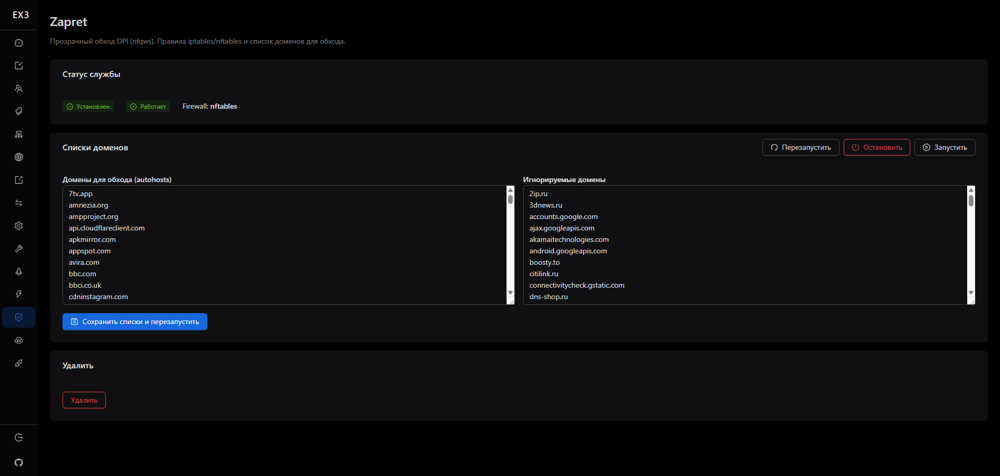
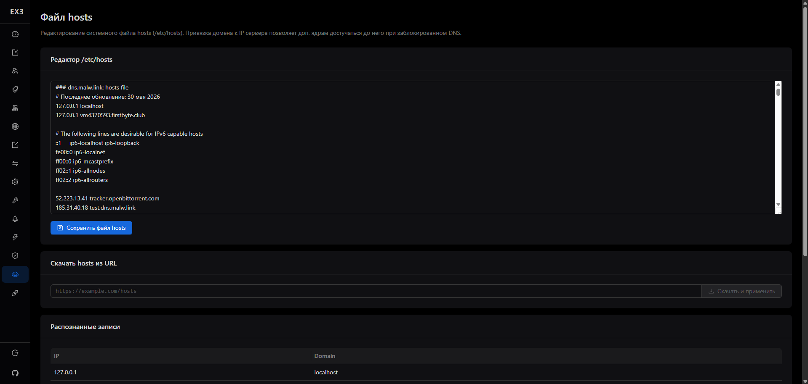

<p align="center">
  
</p>

<p align="center">
  <a href="https://github.com/Bebrik2283555/Ex3-ui/releases"></a>
  <a href="https://www.gnu.org/licenses/gpl-3.0.en.html"></a>
  
</p>

# EX3-UI

**EX3-UI** — форк известной панели [3x-ui](https://github.com/MHSanaei/3x-ui), заточенный под обход блокировок в России и оптимизацию под слабые VPS-серверы.

## Что внутри

- **Изменённый стиль UI**
- **Поддержка ядер для обхода блокировок через звонки российских сервисов из белого списка:**
  - [qWDTT](https://github.com/SpaceNeuroX/proxy-turn-vk-android) — форк [WDTT](https://github.com/amurcanov/proxy-turn-vk-android)
  - [olcRTC](https://github.com/openlibrecommunity/olcrtc)
- **zapret** — обход DPI-блокировок ([zapret-linux-easy](https://github.com/ImMALWARE/zapret-linux-easy), интегрирован в панель)
- **hosts** — обход гео и DPI-блокировок для серверов в России (можно использовать свой список или [этот](https://info.dns.malw.link/hosts))
- **Оптимизация под слабые VPS:**
  - установка системного DNS-сервера
  - включение BBR
  - настройка TCP-буферов и очереди
  - создание Swap
- Возможна установка на самоподписанный сертификат, что полезно при временном бане Lets Encrypt

> **ВНИМАНИЕ!** При установке на самоподписанный сертификат многие VPN-клиенты будут выдавать ошибку сертификата — используйте только если реально нужно.

## Установка

### С нуля

Введите в терминал (root):

```bash
bash <(curl -Ls https://raw.githubusercontent.com/Bebrik2283555/Ex3-ui/main/install.sh)
```

### На уже установленную панель (без потери данных)

Если у вас уже стоит 3x-ui — это поставит дополнительные ядра и обновит панель, не трогая базу данных и конфиги:

```bash
bash <(curl -Ls https://raw.githubusercontent.com/Bebrik2283555/Ex3-ui/main/install-extra.sh)
```

### Скачивание релизов

| Архитектура | Ссылка |
| --- | --- |
| amd64 | [x-ui-linux-amd64.tar.gz](https://github.com/Bebrik2283555/Ex3-ui/releases/latest/download/x-ui-linux-amd64.tar.gz) |
| arm64 | [x-ui-linux-arm64.tar.gz](https://github.com/Bebrik2283555/Ex3-ui/releases/latest/download/x-ui-linux-arm64.tar.gz) |

## Поддерживаемые архитектуры

`amd64` и `arm64`. Тестировалось на Debian 12 (amd64).

## Скриншоты

<details>
<summary>Скриншоты панели</summary>








</details>

## Примечание

Данный проект написан с помощью ИИ, в некоторых новых функциях могут быть баги.

## Лицензии

| Компонент | Репозиторий | Лицензия |
| --- | --- | --- |
| EX3-UI / 3x-ui панель | [MHSanaei/3x-ui](https://github.com/MHSanaei/3x-ui) | GPL-3.0 |
| xray-core | [XTLS/Xray-core](https://github.com/XTLS/Xray-core) | MPL-2.0 |
| mtg-multi (MTProto) | [mhsanaei/mtg-multi](https://github.com/mhsanaei/mtg-multi) | MIT |
| qWDTT (fork WDTT) | [SpaceNeuroX/proxy-turn-vk-android](https://github.com/SpaceNeuroX/proxy-turn-vk-android) | GPL-3.0 |
| WDTT | [amurcanov/proxy-turn-vk-android](https://github.com/amurcanov/proxy-turn-vk-android) | GPL-3.0 |
| olcRTC | [openlibrecommunity/olcrtc](https://github.com/openlibrecommunity/olcrtc) | WTFPL-2.0 |
| zapret | [ImMALWARE/zapret-linux-easy](https://github.com/ImMALWARE/zapret-linux-easy) | MIT |

Полные тексты лицензий — в каталоге [`licenses/`](licenses/) (в релизном архиве) и в исходниках соответствующих проектов.